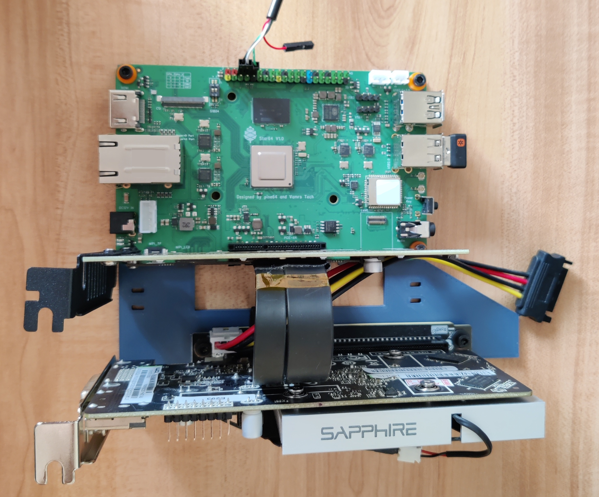
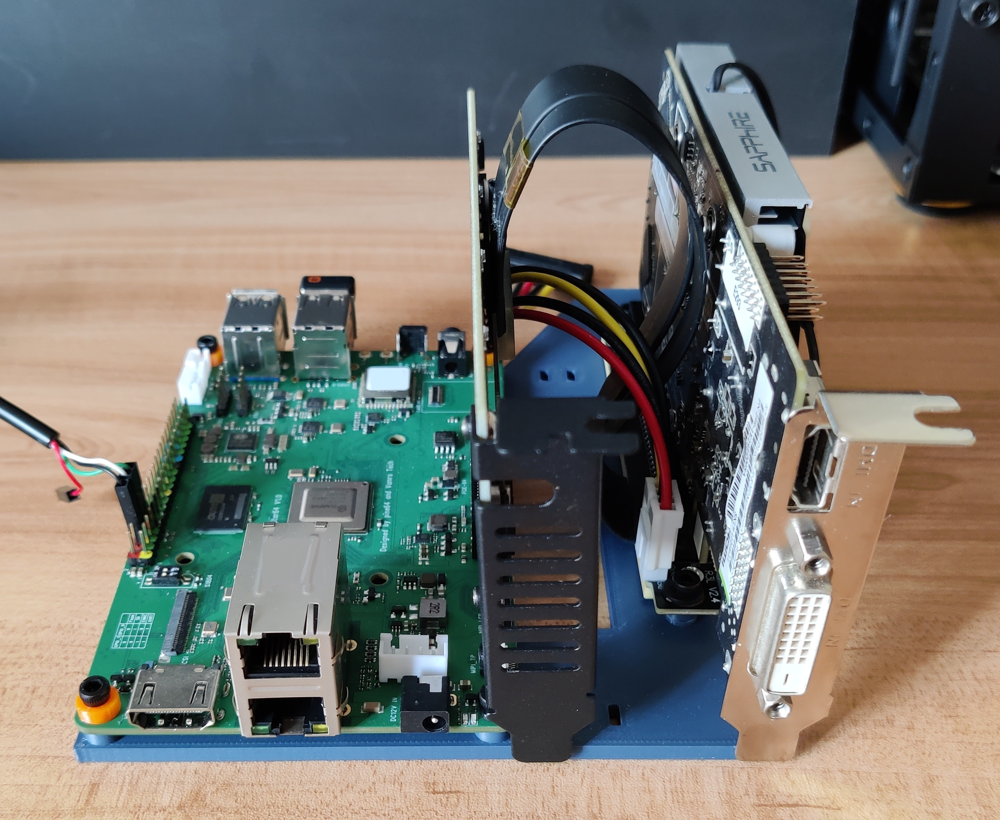
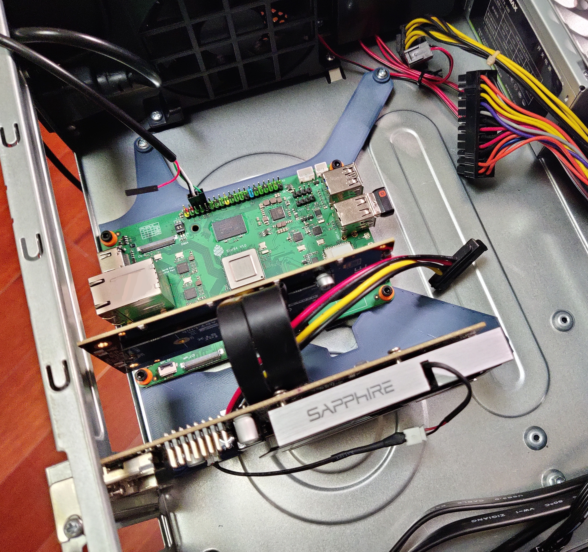
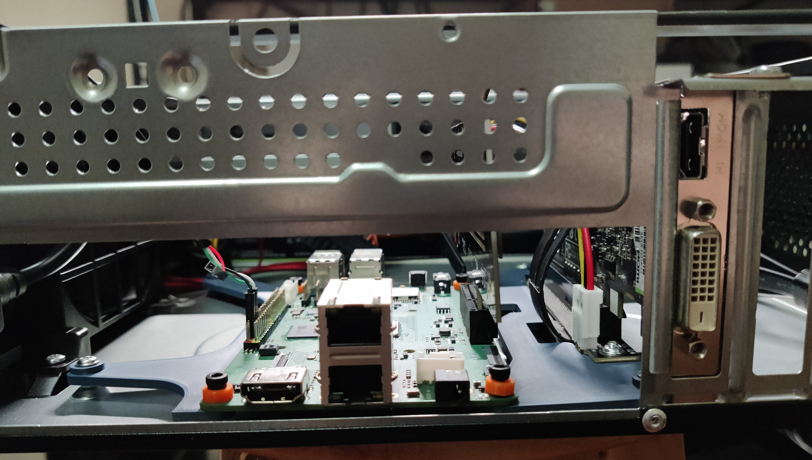

# Star64-mounting-brackets
Standalone Desktop mounting brackets and ITX mounting brackets for PINE64 Star64 SBC

> All mounting hole using M3 screws (M3*8 used here, length depends on circumstances)

> PCIe extender: ADT-Link R23SL-PW (You should power this extender using the same rail as powering main board, only 12V needed)

Standalone stand:

 

ITX mounting:

 

## Similar Projects
https://wiki.pine64.org/wiki/ROCKPro64#3D_printable_ITX_mounting_brackets

> Star64 and RockPro64 have a slight difference on mounting hole position, mounting for RockPro64 may work with Star64.
